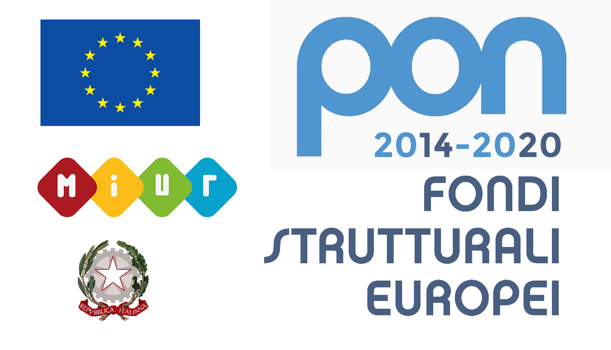

+++
# Project title.
title = "Ecology"

# Date this page was created.
date = "2018-04-01"

# Project summary to display on homepage.
summary = "Ecology"

# Tags: can be used for filtering projects.
# Example: `tags = ["machine-learning", "deep-learning"]`
tags = ["ecology","research-project"]

# Optional external URL for project (replaces project detail page).
external_link = ""

# Slides (optional).
#   Associate this project with Markdown slides.
#   Simply enter your slide deck's filename without extension.
#   E.g. `slides = "example-slides"` references
#   `content/slides/example-slides.md`.
#   Otherwise, set `slides = ""`.
slides = ""

# Links (optional).
url_pdf = ""
url_slides = ""
url_video = ""
url_code = ""

# Custom links (optional).
#   Uncomment line below to enable. For multiple links, use the form `[{...}, {...}, {...}]`.
# url_custom = [{icon_pack = "fab", icon="twitter", name="Follow", url = "https://twitter.com/georgecushen"}]

# Featured image
# To use, add an image named `featured.jpg/png` to your project's folder.
[image]
  # Caption (optional)
  caption = ""

  # Focal point (optional)
  # Options: Smart, Center, TopLeft, Top, TopRight, Left, Right, BottomLeft, Bottom, BottomRight
  focal_point = "Center"
+++

# National Biodiversity Future Center

NBFC, CN5 (Hub in Palermo), 8 Spokes

#### People

Amos Maritan, Sandro Azaele, Davide Bernardi, Alice Doimo and Francesco Ferraro

#### Collaborators

Alessandro Alboresi (DiBIO), Tommaso Anfodillo (TESAF),  Barbara Baldan (DiBIO), Lucio Bonato (DiBIO), Thomas Campagnaro (TESAF), Leonardo Congiu (DiBIO), Giuseppe Fusco (DiBIO), Clelia Gasparini (DiBIO), Alessandro Grapputo (DiBIO), Nicoletta La Rocca (DiBIO), Andrea Pilastro (DiBIO), Gil Rosenthal (DiBIO) and Tommaso Sitzia (TESAF)

#### Duration

From 1st Sept 2022 to 31st Aug 2025

> #### Fundings
> 

  

# Emergent Dynamical Patterns of Disordered Systems with Applications to Natural Communities (2022WPHMXK)

UniPD, GSSI, UniRoma1 

#### Description
This project aims to apply physics principles from disordered systems to theoretical ecology to study large-scale properties of species-rich ecosystems. Key objectives include:

- Using quenched random variables to model environmental randomness and species heterogeneity
- Examining equilibrium and non-equilibrium properties of community models, including their empirical setting and statistical inference
- Developing models that incorporate species interactions in varying environments
- Creating a unified statistical mechanics framework to explain and predict biodiversity patterns

The research will analyze models which include processes such as reproduction, death, metabolism, dispersal, migration, and species interactions to understand how stable biodiversity is maintained. This understanding is crucial for ecosystem sustainability and developing forecasting strategies for disturbances like pathogens, climate change, and human impacts.

The project unites researchers from statistical mechanics and condensed matter physics into an interdisciplinary team combining expertise in disordered systems and complex ecological systems. It involves collaboration between three Italian universities (Padova, Rome "La Sapienza", and Gran Sasso Science Institute-L'Aquila) and aligns with European Green Deal and Italian "Piano Nazionale di Ripresa e Resilienza" priorities, particularly regarding biodiversity preservation.

#### People

Amos Maritan, Sandro Azaele and Christian Grilletta

#### Collaborators

Giacomo Gradenigo, Maria C. Angelini and Andrea Crisanti

#### Duration

From 1st Oct 2023 to 31st Dec 2025

> #### Fundings
> 

  

# Ecological responses to perturbations

#### People

Sandro Azaele, Samir Suweis, Davide Zanchetta

#### Collaborators

Piratech

> #### Fundings
Fundings received from MUR: 209,723€
> 

  

# Coevolutionary modelling of sustainable use of common pool resources

#### People

Sandro Azaele, Samir Suweis, Fabio Menegazzo

#### Collaborators

Piratech

> #### Fundings
> 

  

# Anchialos: Diversity, Function, and Resilience of Italian Coastal Aquifers upon Global Climatic Changes

#### Description

This project aims to develop a holistic understanding of how climate change impacts coastal aquifers, ecosystems crucial for over a billion people. The primary objectives include:
- Characterizing coastal aquifer biodiversity using a combination of zoology, ecology, molecular biology, and complex systems science.
- Developing ecological networks to model the resilience of these ecosystems to large-scale climatic changes.
- Creating a unified theoretical framework that bridges species-level dynamics with ecosystem-wide processes.

The project focuses on four key coastal karstic aquifers in Italy: Capo Caccia (SS), Punta Campanella (NA), Monte Argentario (GR), and Castro Marina (LE). These sites will be sampled through caves and beaches to analyze biodiversity and ecological parameters.

The research is structured into four working packages (WPs):
1. Biodiversity Characterization: Identifying species and their traits using high-throughput sequencing (HTS).
2. Quantifying Species Abundances: Robustly estimating population distributions across different habitats.
3. Experimental Analysis: Conducting in-situ mesocosm experiments to assess species interactions under varying environmental conditions.
4. Ecological Network Modeling: Integrating data to simulate biodiversity changes under future climate scenarios.

##### Scientific and Societal Impact
- Discovery of new species and development of open-access datasets for conservation.
- Enhancement of management strategies for coastal aquifers, supporting biodiversity preservation.
- Public outreach and dissemination, raising awareness about aquifer vulnerability and ecosystem services.

This project aligns with global sustainability goals by offering a framework to protect and manage coastal aquifers in Italy, with potential applications in other European regions and aligns with European Green Deal and Italian “Piano Nazionale di Ripresa e Resilienza” priorities, particularly regarding biodiversity preservation.

#### Duration
From 1st Oct 2023 to 30th Sept 2025

> #### Fundings
Fundings received from MUR for the Padua unit: 70,000€
> 
