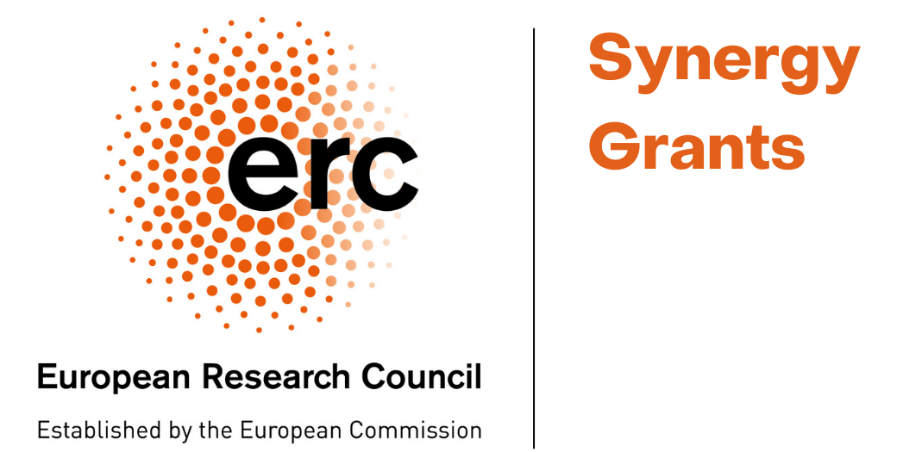

+++
# Project title.
title = "Neuroscience"

# Date this page was created.
date = "2018-03-01"

# Project summary to display on homepage.
summary = "Statistical Physics and Network Science are decisively contributing to describe the complex, self-organizing structure and dynamics of the human brain. We are part of the Padova Neuroscience Center and in this area we lead four projects."

# Tags: can be used for filtering projects.
# Example: `tags = ["machine-learning", "deep-learning"]`
tags = ["neuroscience","research-project"]

# Optional external URL for project (replaces project detail page).
external_link = ""

# Slides (optional).
#   Associate this project with Markdown slides.
#   Simply enter your slide deck's filename without extension.
#   E.g. `slides = "example-slides"` references
#   `content/slides/example-slides.md`.
#   Otherwise, set `slides = ""`.
slides = ""

# Links (optional).
url_pdf = ""
url_slides = ""
url_video = ""
url_code = ""

# Custom links (optional).
#   Uncomment line below to enable. For multiple links, use the form `[{...}, {...}, {...}]`.
# url_custom = [{icon_pack = "fab", icon="twitter", name="Follow", url = "https://twitter.com/georgecushen"}]

# Featured image
# To use, add an image named `featured.jpg/png` to your project's folder.
[image]
  # Caption (optional)
  caption = ""

  # Focal point (optional)
  # Options: Smart, Center, TopLeft, Top, TopRight, Left, Right, BottomLeft, Bottom, BottomRight
  focal_point = "Center"

+++

Statistical Physics and Network Science are decisively contributing to describe the complex, self-organizing structure and dynamics of the human brain. We are part of the Padova Neuroscience Center and in this area we lead four projects.

# Emergent neural activity and Brain Criticality

#### People

Samir Suweis, Ramon Guevara, Benedetta Mariani, Giacomo Barzon, Jesus Encinas 

  

# Effect of stroke and diseases in brain structure and dynamics

#### People

Samir Suweis, Michele Allegra, Ramon Guevara, Giacomo Barzon 

  

# Response theory for brain network discovery and control

#### People

Michele Allegra, Samir Suweis, Sandro Azaele, Amos Maritan, Giacomo Barzon, Ramon Guevara, Jacopo Fadanni 

  

# Dynamics in biological and artificial neural networks and whole brain models

#### People

Samir Suweis, Michele Allegra, Sandro Azaele, Amos Maritan, Elisa Tentori, Andrea Veronese, Ramon Guevara 

  

   

## Projects Collaborators

Pietro Avanzini, Maurizio Corbetta, Marco Dal Maschio, Judith Gervain, Marcello Massimini, Davide Momi, Giorgio Nicoletti, Pietro Rotondo and Stefano Vassanelli

  

> # Fundings
>
>  ERC Synergy
>  PRIN 2022
>  PARD 2023 - UNIPD DFA
>  FARE (MUR)
>  PON
>  Dottorato Nazionale  -  Theoretical and Applied Neuroscience
